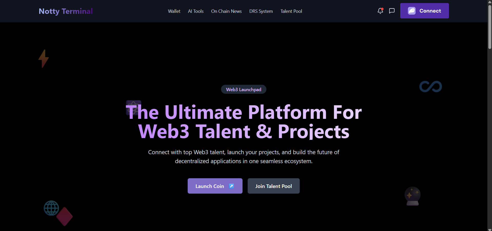

# Notty Terminal

## The Permissionless Launchpad with Built-in Trust

Notty Terminal is a revolutionary permissionless launchpad powered by a Dynamic Reputation System (DRS) that transforms on-chain behavior into quantifiable reputation and trust. In an industry plagued by rugs and scams, Notty creates a transparent ecosystem where every wallet builds a verifiable reputation based on real activity.

## Why Notty Terminal?

### The Problem
The crypto token market suffers from information asymmetry and misaligned incentives:
- Retail investors have no reliable way to evaluate projects or developers
- Quality developers struggle to differentiate themselves from scammers  
- Centralized launchpads act as expensive gatekeepers with manual approvals

### Our Solution
Notty Terminal solves this through:

- ✅ **Incentivized Good Behavior**: Both developers and traders earn reputation by delivering value
- ✅ **Earned Reputation**: On-chain actions automatically adjust DRS scores
- ✅ **Full Permissionlessness**: Anyone can launch a project with no gatekeepers or approvals
- ✅ **Transparent Trust Layer**: Users can see each wallet's history and scores before interacting

> "Crypto adoption starts with trust. Notty Terminal builds it one wallet at a time."

  
  

## Technology Architecture

### Smart Contract Layer (Solana/Anchor)
- Token Factory with standardized parameters
- Vault system for token liquidity
- On-chain event emission for reputation tracking
- PDA-secured operations

### Dynamic Reputation System
- **DeveloperScore**: Evaluates project creators based on history and outcomes
- **TraderScore**: Quantifies trading behavior from holding to dumping
- **TokenScore**: Holistic assessment of token quality and risk

### Backend Infrastructure
- Real-time WebSocket listener for on-chain events
- Specialized parser for structured data transformation
- Django-based API services with Channels for WebSocket broadcasting

## 🎯 MVP Focus: Show, Don’t Just Tell

Our MVP demonstrates the value of on-chain reputation with a lean feature set:

1. **Token Reputation Mechanism**
   - Dynamic DRS score at launch (2–3 core metrics).
   - **Metric Examples**:
     - Age since deployment
     - Holder count
     - Developer transaction history

2. **Permissionless Fair Launchpad**
   - One-click token launch—no presales or taxes.
   - Reinforces unbiased reputation narrative.

3. **Visual Reputation Display**
   - Score badges on token listings.
   - Tooltips or pie charts for metric breakdown.

## Market Traction & Roadmap

### Current Status (Q2 2025)
- ✓ MVP developed with core reputation scoring

### Q3 2025
- Public beta launch on Solana mainnet
- Integration with major wallets and explorers
- Advanced reputation algorithms with ML components

### Q4 2025
- Full production release
- Developer SDK and API access
- Cross-chain expansion

## The DRS Advantage

Our Dynamic Reputation System creates multiple competitive moats:

1. **First-Mover Advantage**: Pioneering on-chain reputation tracking
2. **Data Network Effects**: System becomes more valuable with each transaction
3. **Two-Sided Network Effects**: Better developers attract more users, and vice versa
4. **Transparent Algorithms**: Open reputation models build trust

### DeveloperScore Factors
| Metric | Weight |
|--------|--------|
| Projects longevity | High |
| Holder retention | Medium |
| Market stability | Medium |
| Rug/Scam history | Critical |

### TokenScore Calculation
| Factor | Weight |
|--------|--------|
| Age | Medium |
| Holder distribution | High |
| Trading volume | Medium |
| Price stability | Medium |
| Creator reputation | High |

  
  

## 🛠️ Technology Stack

Built for reliability, security, and scale:

- **Smart Contract**: Rust + Anchor Framework (Solana)
- **Backend**: Django + Channels (WebSocket) + PostgreSQL
- **Event Processor**: Real-time on-chain data parser and scoring engine
- **Frontend**: React + TailwindCSS with intuitive UX

## Team

Our team combines deep expertise in both crypto and reputation systems:

**Tess** - CEO & founder
- Background in [relevant experience]
- Previously [achievement]

**Matin** - CTO & Smartcontract Developer
- 3months Solana Development experience
- Led frontend engineer at I38

**Peterben** - Backend Engineer
- Software Engineer at Novena
- Deep expertise in Backend and app devlopment

**Peter** - Frontend Engineer
- [relevant area]
- Deep expertise in [relevant area]

## 📞 Contact

Ready to build the trust layer of web3 with us?  
- Email: nottyterminal@gmail.com
- Twitter: [@NottyTerminal](https://x.com/Nottytmn)

**Notty Terminal Inc.**  
All rights reserved. Confidential information.

---

*Crypto adoption starts with trust. Notty Terminal builds it one wallet at a time.*
